# Weissgerber Showcase

Three iOS apps built to actually get out of your way. No accounts to create, no subscriptions forced on you, no ads. Just tools that do one thing well.

Website: [weissgerber.dev](https://weissgerber.dev)

## Vitae, Study Planner & Focus Sessions

[Preview](https://weissgerber.dev/apps/vitae) · [Download on the App Store](https://apps.apple.com/app/id6752669220)

The hard part of studying isn't the studying, it's deciding what to study. Vitae takes your subjects, your exams and the hours you're actually free, builds a study week out of them, and then opens on a single recommended session with the reason written underneath: an exam in six days, a block you planned for 14:00, a subject you haven't touched all week. Press start and it runs the session for you, with a Pomodoro timer, ambient sound, and binaural audio if you want it.

No AI, no prediction. The recommendation is a fixed order of rules applied to data you entered yourself, which is why the app can explain every choice and why it works with no connection.

  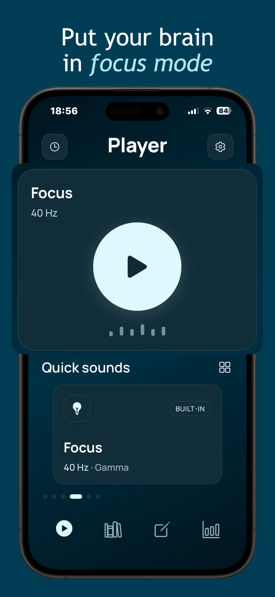
  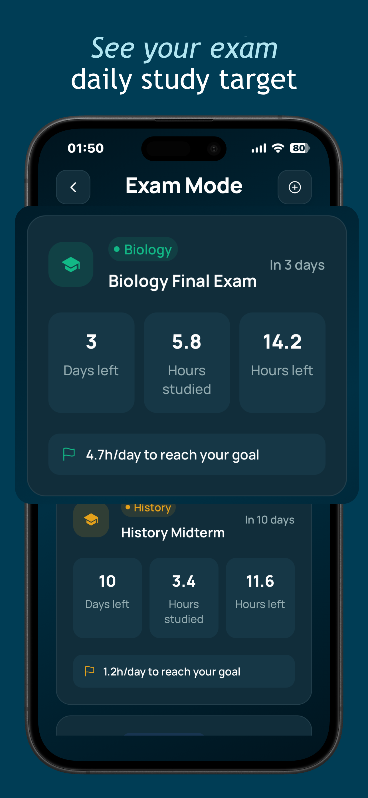
  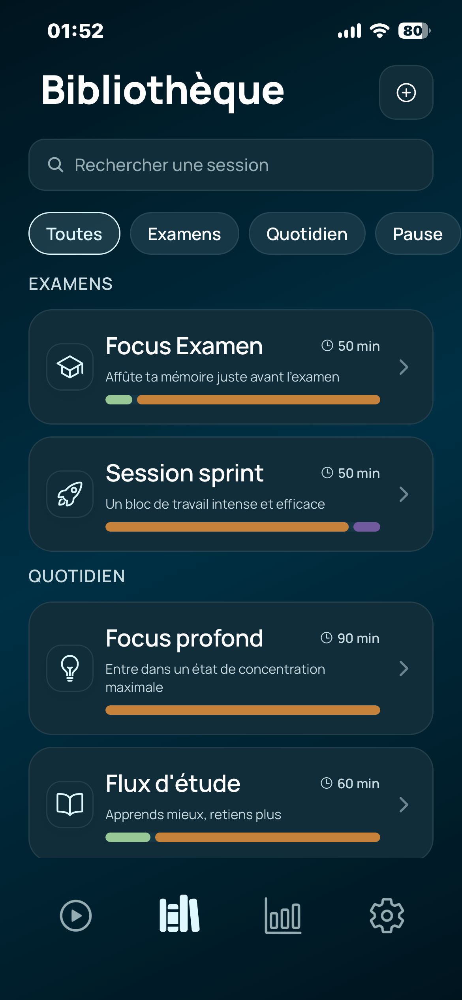
  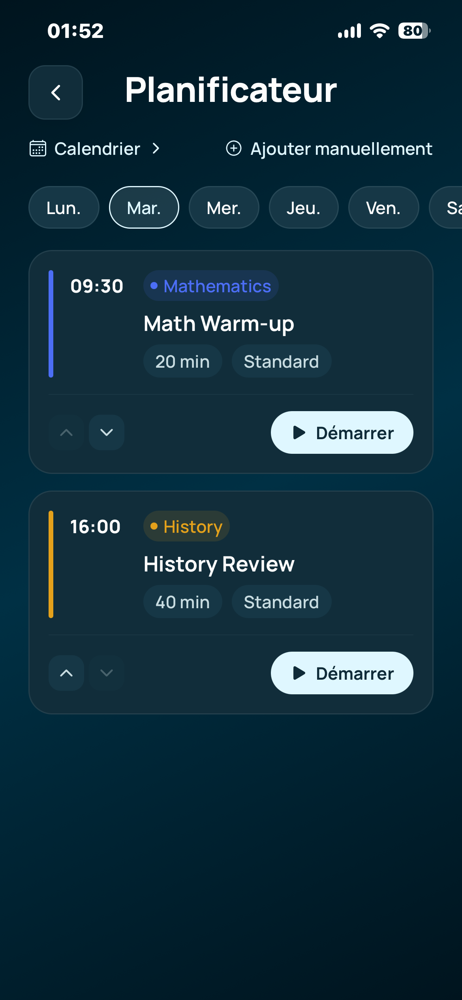

**Features**
- Study planner: a weekly schedule of editable study blocks, built from your availability
- Exam mode: exam dates, target hours, days left, and the daily target to stay on track
- A recommended session on the home screen, with the rule it came from shown alongside it
- Guided multi-step focus sessions for study, exam prep and recovery between blocks
- Pomodoro timer, alternating focus blocks and breaks with a longer break every four cycles
- Ambient sounds and optional binaural audio layered under the session
- Subjects, per-subject progress, weekly goal and streaks
- Fully offline: audio ships with the app, your plan and stats stay on your device

**Why it stands out**
- Planning, exam tracking, Pomodoro and unlimited subjects are free, not paywalled
- Premium is a one-time purchase for lifetime access: full session library, all ambient sounds, premium themes, detailed statistics
- No account, no ads, no subscription
- Available in English and French

## TravelBudget, Money Manager

[Preview](https://weissgerber.dev/apps/travelbudget) · [Download on the App Store](https://apps.apple.com/us/app/travelbudget-money-manager/id6758573416)

Traveling across three countries and three currencies shouldn't mean losing track of your money. TravelBudget converts every expense automatically, keeps a running total against your budget, and works entirely offline so a bad connection abroad never gets in your way.

  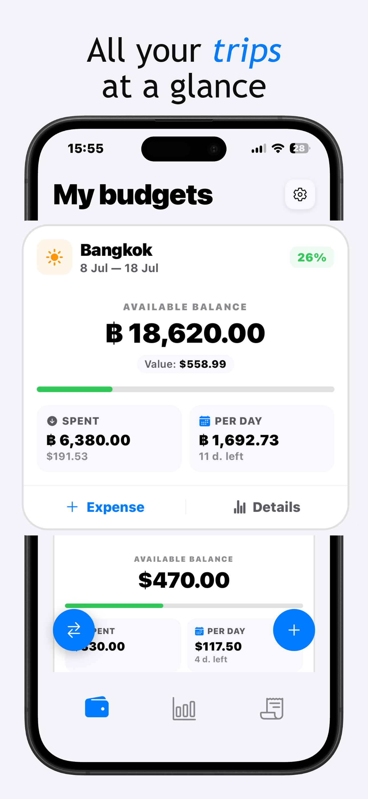
  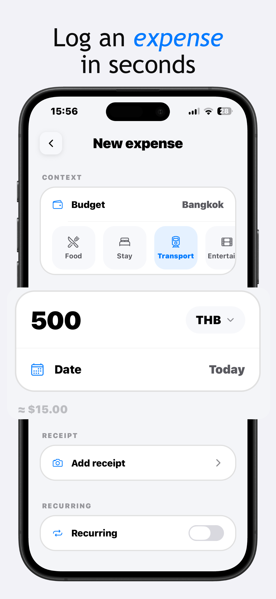
  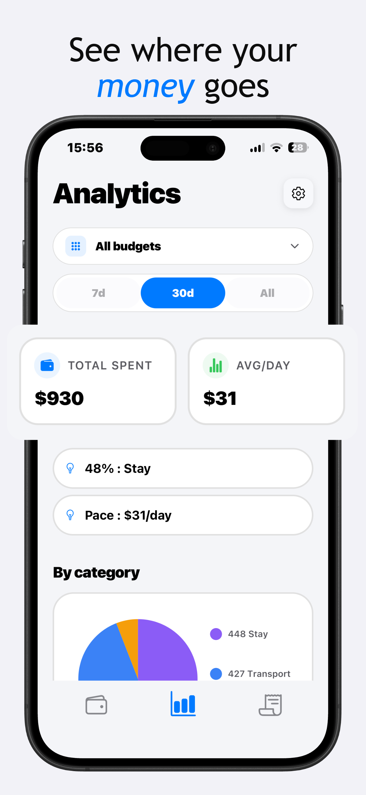
  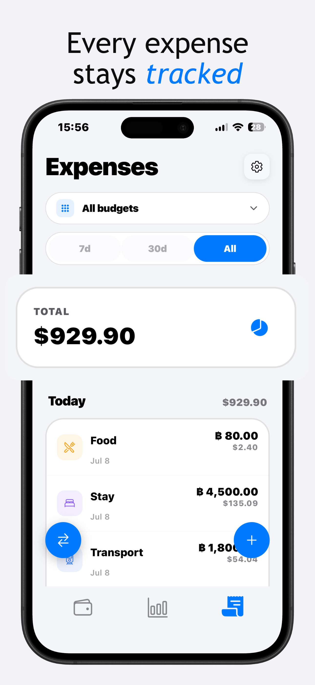

**Features**
- Automatic multi-currency conversion for every expense
- Real time budget tracking with remaining daily spend
- Trip templates for common destinations
- Receipt photos stored locally on your device
- Expense splitting between travelers, no account required
- Spending analytics by category and by trip

**Why it stands out**
- No account, no cloud sync, your data stays on your phone
- Works fully offline, exchange rates cached for when you have no signal
- One time purchase for the Pro version, no subscription

## Forma, Muscle Recovery Tracker

[Preview](https://weissgerber.dev/apps/forma) · [Download on the App Store](https://apps.apple.com/us/app/muscle-recovery-tracker/id6755316806)

Stop guessing which muscles are actually ready to train. Forma tracks your real recovery per muscle group and builds today's workout around it, if your chest is still sore, it'll point you toward legs instead of forcing a rigid plan.

  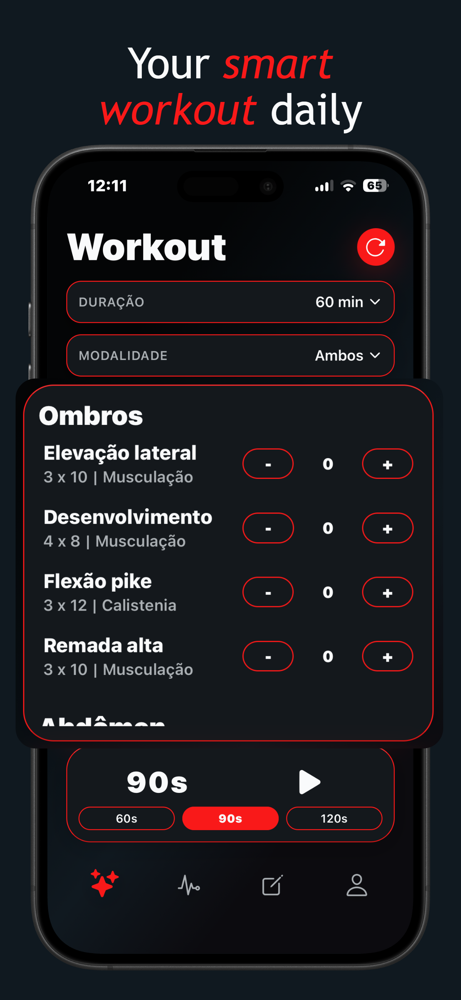
  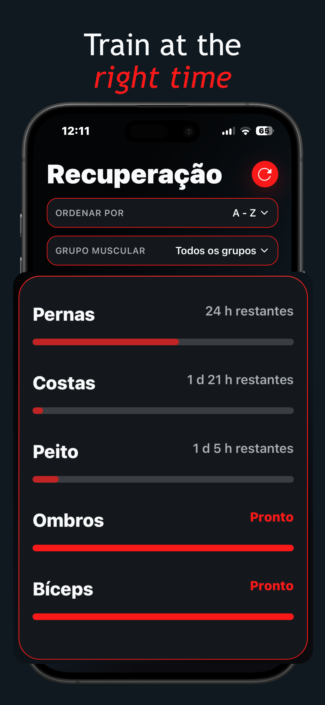
  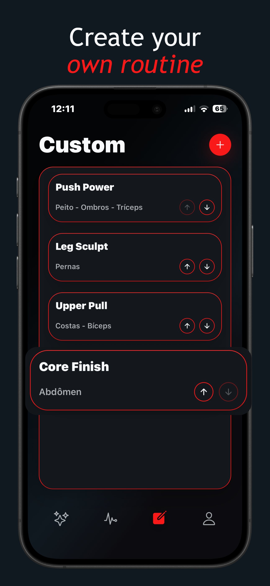
  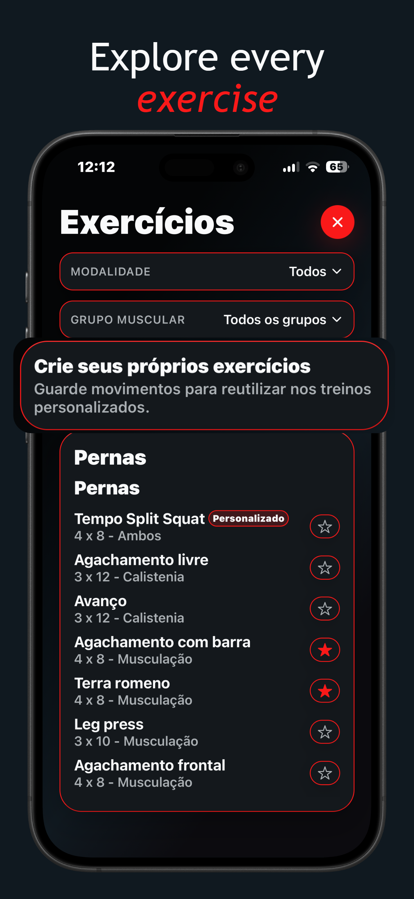

**Features**
- Smart mode generates your workout automatically based on real recovery data
- Custom mode if you'd rather build your own session
- Real time muscle fatigue tracking per muscle group
- Exercise catalog filterable by available equipment, gym or home
- Workout history and progress tracking
- Available in English, French, German, Italian, Portuguese and Spanish

**Why it stands out**
- Adapts to you instead of following a fixed weekly split
- No social feed, no distractions, just your next workout
- Works for beginners and experienced lifters alike